# OpenGL-physics

C++와 OpenGL을 활용한 게임 물리 구현 프로젝트

## 구현 결과

### 바운스 볼

소스: [FrameWork_Bouncing_Ball](./FrameWork_Bouncing_Ball)

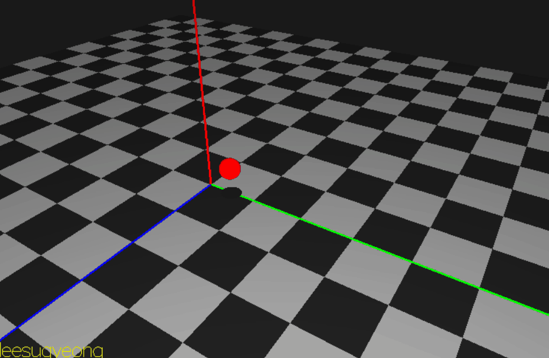

### 충격량을 이용한 바운스

소스: [FrameWork_Bouncing_Impulse](./FrameWork_Bouncing_Impulse)

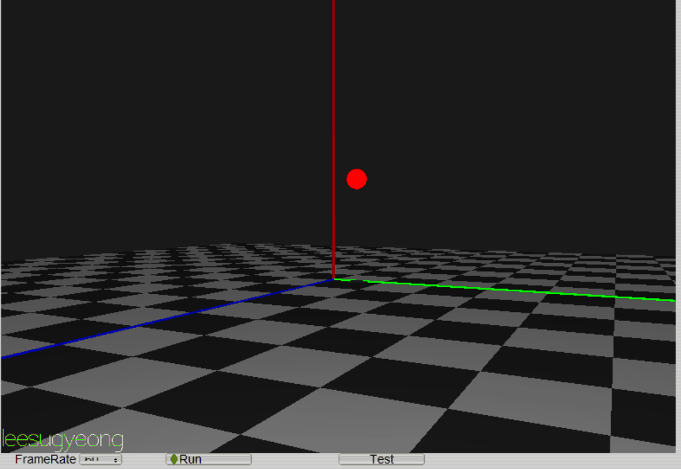

### 직선 이동

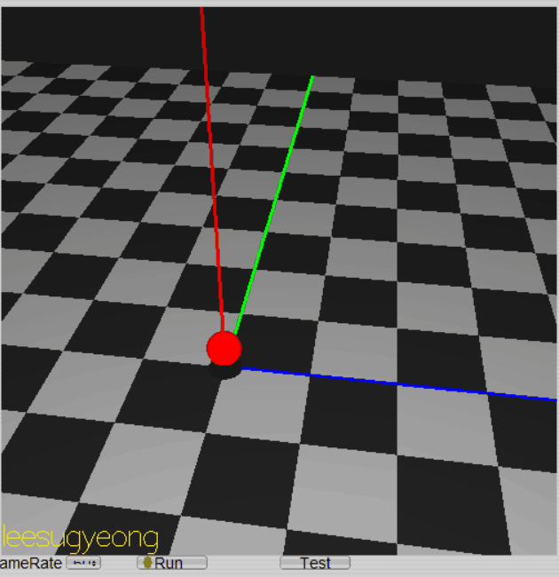

### 바운스 볼 바람 효과

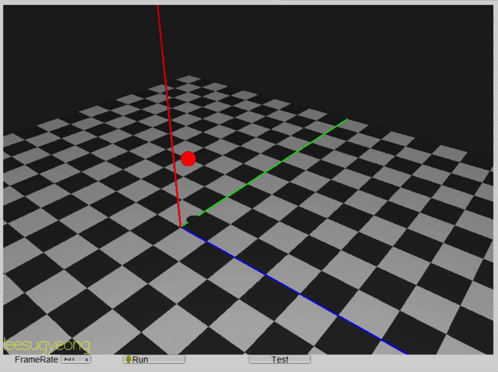

### 포탄 발사

소스: [FrameWork_Artillery](./FrameWork_Artillery)

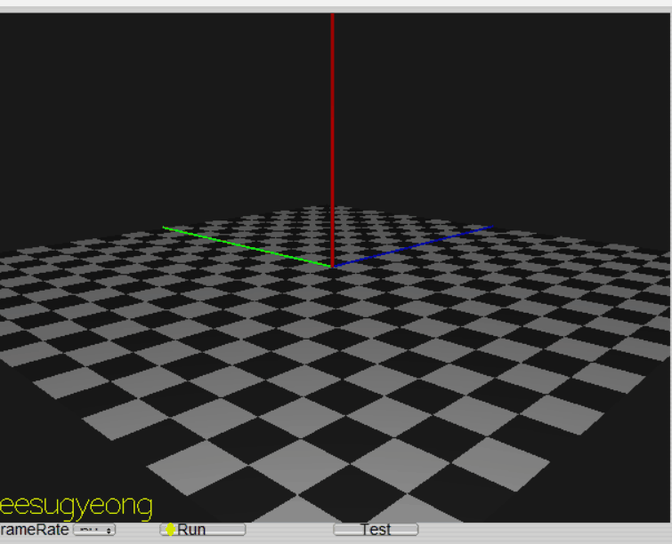

### 불꽃놀이

소스: [FrameWork_FireWork](./FrameWork_FireWork)

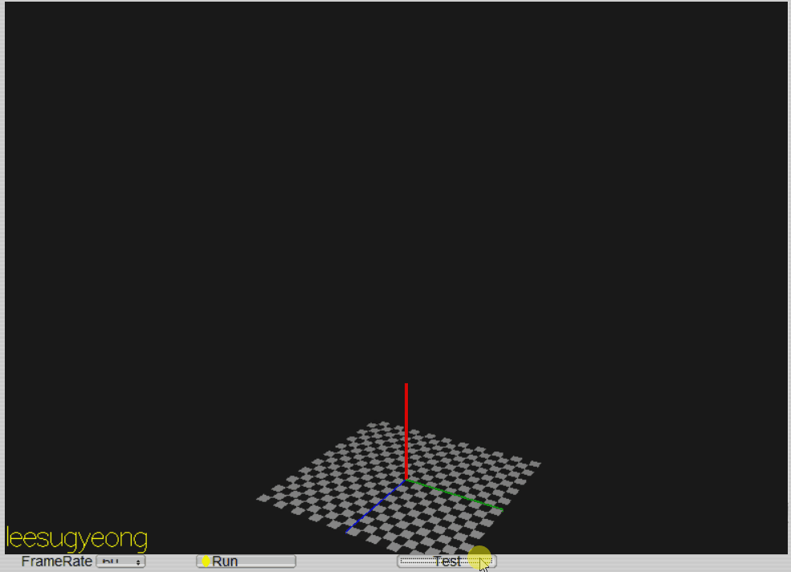

### 스프링

소스: [FrameWork_Spring](./FrameWork_Spring)

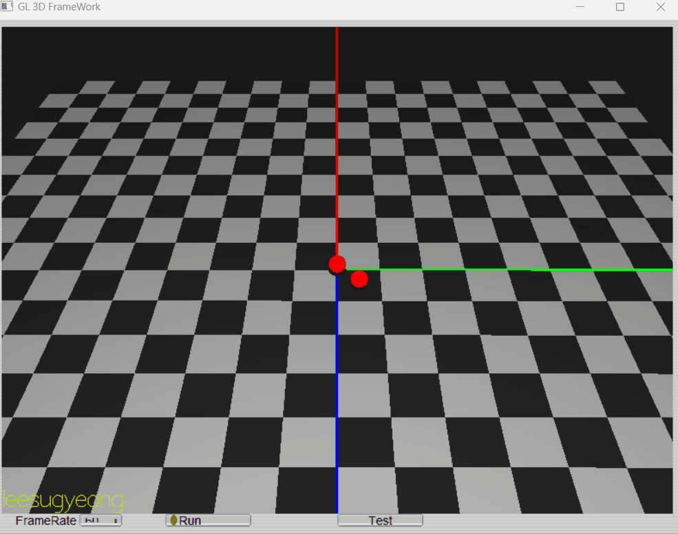

### 고정점 스프링

소스: [FrameWork_Anchored_Spring](./FrameWork_Anchored_Spring)

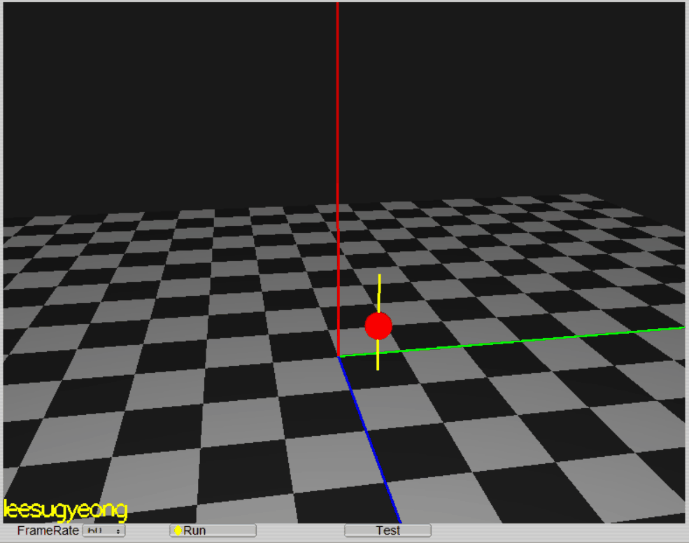

### 스프링과 충격량

소스: [FrameWork_Spring_Impulse](./FrameWork_Spring_Impulse)

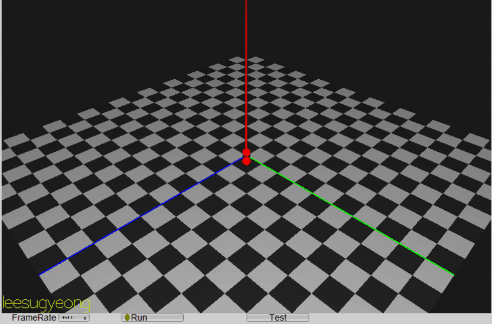

### 부력

소스: [FrameWork_Buoyancy_force](./FrameWork_Buoyancy_force)

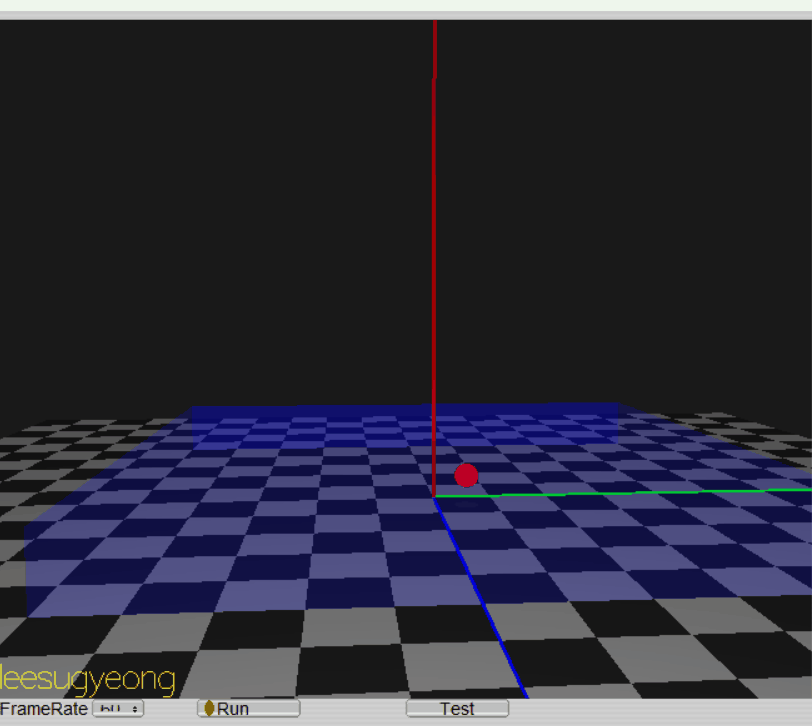

### 물체 선택

소스: [FrameWork_Picking](./FrameWork_Picking)

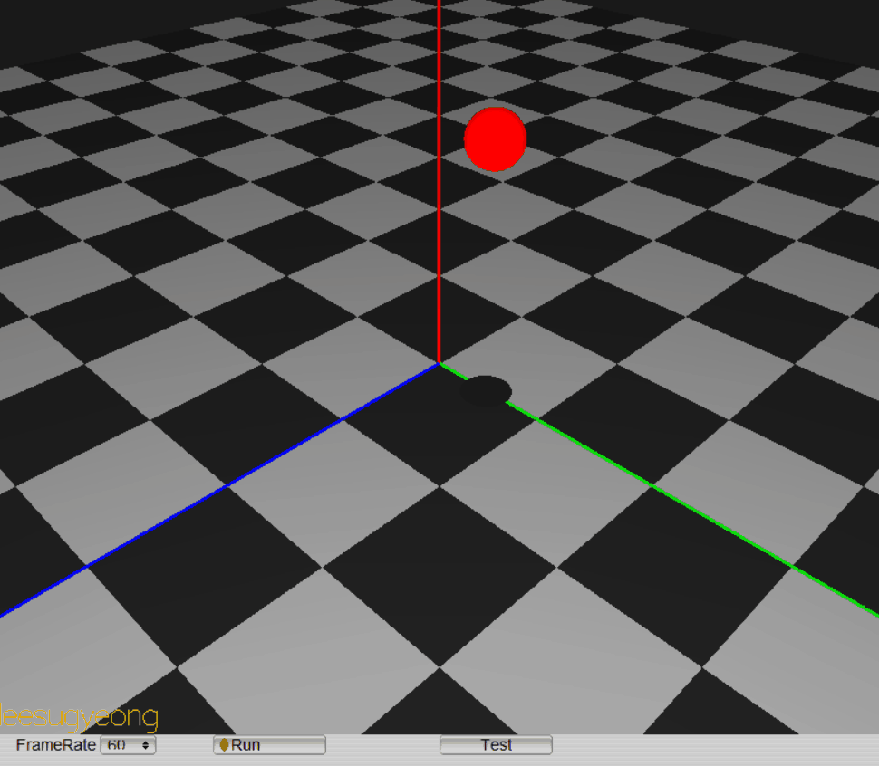

### 선택한 물체에 힘 적용

소스: [FrameWork_Pickig_Adding_Force](./FrameWork_Pickig_Adding_Force)

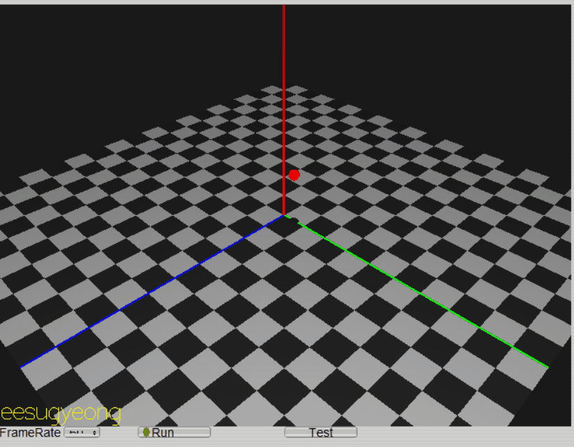

### 물체 드래그 및 던지기

소스: [FrameWork_Pickig_drag](./FrameWork_Pickig_drag)

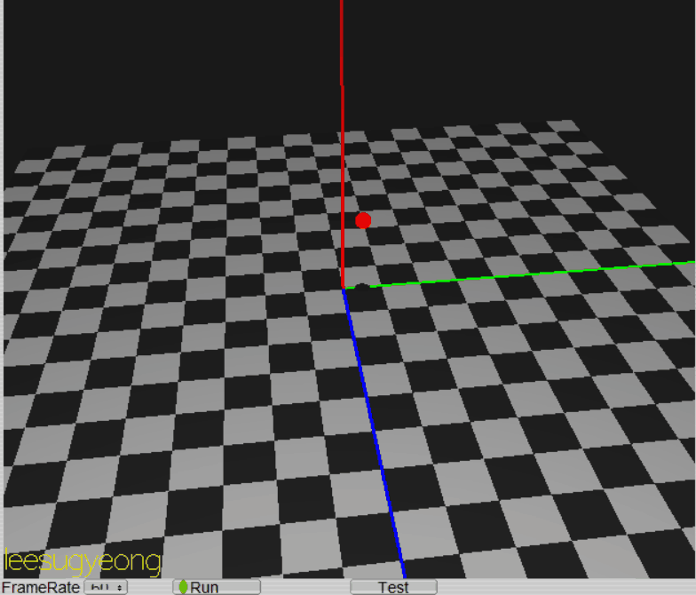

### 파티클간 충돌

소스: [FrameWork_ParticleWorld](./FrameWork_ParticleWorld)

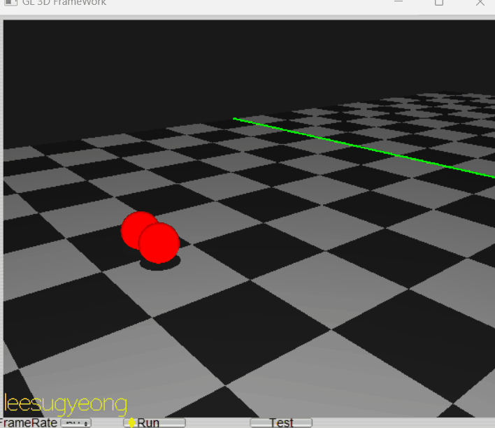

### 다리

소스: [FrameWork_Brige](./FrameWork_Brige)

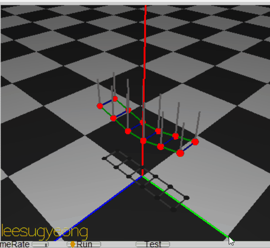

